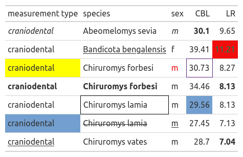

# `forgts`

`forgts` is a Python package that extracts cell formatting from Excel files and applies it to `great_tables` objects, allowing for detailed and consistent data representation.

[](https://pypi.org/project/forgts/)
[](https://www.gnu.org/licenses/mit)
[](https://github.com/fer-aguirre/forgts/issues)

## Features

- Extracts formatting from Excel spreadsheets.
- Translates Excel formatting attributes to `great_tables` compatible formats.
- Applies styling including font styles, colors, and borders to `great_tables` objects.

## Installation

To install `forgts`, use:

```bash
pip install forgts
```

This package requires Python 3.11 and has dependencies on `pandas`, `openpyxl`, and `great_tables`.

## Usage

Here's a basic example to get you started:

```python
from forgts import format_gt_from_excel

# Format a Great Table from an Excel file
gt_object = format_gt_from_excel('./example/example.xlsx')

# Output the formatted GT object
gt_object
```

Output
```
>INFO:forgts:Starting the formatting process from Excel.
>INFO:forgts:Extracting formatting information.
>INFO:forgts:Translating formatting to great_tables format.
>INFO:forgts:Applying formatting to the GT object.
>INFO:forgts:Formatting process completed.
```



## Directory Structure

```
├── .gitignore
├── LICENSE
├── README.md
├── _quarto.yml
├── custom.scss
├── docs
├── example
│   ├── example.ipynb
│   ├── example.png
│   └── example.xlsx
├── forgts
│   ├── __init__.py
│   ├── get_formatting.py
│   ├── styling.py
│   └── translate_formatting.py
├── index.qmd
├── poetry.lock
├── pyproject.toml
├── setup.py
└── tests
    ├── test__init__.py
    ├── test_get_formatting.py
    ├── test_styling.py
    └── test_translate_formatting.py

```

## Contributing 

Contributions are welcome! Please follow these steps:

1. Fork this repository.
2. Create a new branch: `git checkout -b feature-branch-name`.
3. Make your changes and commit them: `git commit -m 'Add some feature'`.
4. Push to the branch: `git push origin feature-branch-name`.
5. Submit a pull request.

## License

This project is licensed under the [MIT LICENSE](LICENSE).

## Acknowledgments

This package was inspired by the R-package [forgts](https://luisdva.github.io/forgts/) by Luis D. Verde Arregoitia.

This repository was generated with [cookiecutter](https://github.com/cookiecutter/cookiecutter).

## Authors

Created by: Fernanda Aguirre Ruiz
